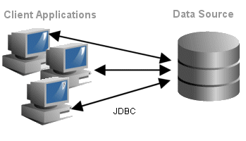
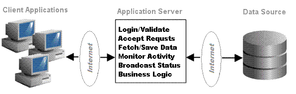

# Automated Direct Phone Sales System

## Overview
### *Contact Management and Direct Sales Automation:*
Our highly configurable and scalable system will transform your direct sales
  into an efficient completely paperless operation. This transition
  will be accomplished either incrementally or in one fell swoop depending upon
  your business needs, current level of automation, and the amount of customization
  required.

The system was designed with data privacy and integrity in mind. Your contacts
 are your life blood and must be protected at all costs. Our approach includes 100%
 encrypted communications over a private network with custom client software. In other
 words, we aggressively avoid the inherent security risks in browser based web applications.

In order to to support a direct telephone sales force scattered across multiple
 geographic locations with real time monitoring, the architecture is a server based
 three-tier network application. Feature rich client applications coordinate all employee
 and management activity throughout the sales cycle, including management authorization,
 receiving payment, and up-selling.

Management apps provide updates in real-time, summary reporting, and work (re)assignment.
 There is also automatic scheduling of calls based on customer status and
 the work is automatically routed to the correct employee based on business
 rules or management override.

### *Generating Sales Leads:*
In addition, two ancillary programs facilitate generating sales leads from Internet
 directories:

*  *Data Miner* is a simple but powerful program that allows a user
   to quickly paste contact information gleaned from a directory into specified
   fields. A consistency check is performed before the data is saved. Our
   experience has demonstrated that the efficiency and accuracy of manual
   data extraction more than doubles after upgrading to *Data Miner.*
*  *Sukhumwit Crawler* is a sophisticated program that crawls
   a specified directory automatically searching for and saving contact
   information. A single run of the *Sukhumwit Crawler* can generate
   hundreds of thousands of sales leads.

Both applications are available in versions that output directly to a
  database or to standard CSV format. Both formats are directly compatable with
  our *Contact Management* software. In addition, CSV format is compatable
  with a wide variety of third party software.
 

## Design Considerations
There are four geographically distributed sites: Three Bangkok offices and another
 in Manila. There is also the potential to have sales personal working from home in
 any location  worldwide.

Customer data is the company’s most valuable asset and must be secured at all costs.
 Competitors must be considered to be unscrupulous and insatiable in their attempts to
 acquire leads. Thus, data theft is a tangible and pervasive threat to ongoing operations.

There are discrete stages of customer processing which correspond to increasing value:

*  *Newly Mined* – Find and add potential customers, primarily via Internet directory searches.
*  *Telephone Qualified* – Ensure that the customer is receptive and suitable.
*  *TQ Verified* – Obtain an e-mail address and verify basic personal information is correct. Send initial e-mail to verify the address.
*  *Account Open* - the lead has tentatively been converted to a client pending verification
*  *Account Verified* – Obtain banking information.
*  *Load* – the client is up sold at this point.
*  *Service* - handle client issues

Each of these stages requires a unique client (user interface or program). In
 addition, managers at various levels require a client in order to assign and
 monitor work.

The system will maintain a time-stamped history of all customer interactions
 and notes. At no point may a remote user delete or modify customer data. Change
 requests are routed to the trusted DBA (database administrator) who performs the
 actual updates.

A database administrator application facilitates maintenance and management tasks,
 such as:

*  User Accounts: Create new users, assign privileges, change passwords, and terminate users.
*  Modify Customer Data: To preclude malicious or accidental data loss all modifications to customer information is performed by the DBA.
*  Respond to unexpected events. For instance, the TQ Internet connection may go down, in which case, the DBA could revert to printing out lists of data.
*  Importing, exporting, and bulk updates to data. For example, consider that
 the TQ manager determines that educators are undesirable: The DBA could perform
 a search for all customers with a position that has the words “college” or
 “university,” and update their disposition so they will not be called. Also,
 customer lists may be purchased that are in a foreign format.

Targeted e-mails are sent and tracked at various stages during the conversion process.
 Some are automatic - for instance a welcome e-mail is automatically sent after the
 first contact with a receptive customer. Other canned e-mails may sent by the
 salesman.

These and other promotional contacts (e.g. brochure sent) are tracked in the
 client/lead's history in addition to every telephone contact.

Automated phone dialing is a desirable feature for all customer contacts, both
 to prevent phone number theft and to pace users. (Note: this feature is not yet
 implemented.)

Senior Management updates and alerts via a smart phone app is a desirable feature.
  (Note: this feature is not yet implemented.)

### Applications
__*Raw Admin*__ is the database administrator application (soon to be renamed).
 Although it has numerous features, it is currently used primarily to import raw customer
 data, and generate workload lists for TQ operations.

__*Data Miner*__ is an application that facilitates rapid acquisition of contact
 information from Internet directories. Users simply highlight data in their browser, and
 drag it to the app where some simple verification is performed (e.g. does the phone
 number have at least five digits). Currently it stores all leads in a form that can be
 easily imported into the database administrator application.

__*Raw Dispo*__ allows customer dispositions to be manually updated from the
 printouts processed by the TQ staff.

__*Sukhumwit Crawler*__ strips customer data from Internet directories
 automatically, but requires a parser be coded for each directory.

## Benefits Accrued
These applications have already delivered very real and measurable benefits to the company:

__*Strategic Planning:*__ The system can be queried to ascertain available
 customer leads by country, region, disposition, position, etc. This allows management
 to effectively deploy resources in the data mining and TQ departments. It also affords
 flexibility: A subset of staff can begin to mine contacts in a different country ahead
 of when TQ is ready to move to this country. Or, separate shifts of TQ staffs could
 easily be scheduled working in different time zones.

__*Duplicates Eliminated:*__ Given the salary of TQ staff, it is easy to
 determine the cost savings realized by eliminating duplicate contacts. Less easy to
 measure is the improved moral from no longer hearing, “You already called me!”

__*Mining Efficiencies:*__ The data mining staff has more than doubled it
 output since the institution of the new software.

__*TQ Efficiencies:*__ The TQ staff now has a consistent and organized format
 to work from. Gone are the days of throwing leads on the floor because the format didn’t
 “look promising” for some reason or other. In addition the contacts are now tracked more
 closely which should result in less theft.

__*Automated Data Mining:*__ The crawler proved its viability when a half a
 million leads were generated in just two days from the New Zealand white pages! It also
 successfully mined the New Zealand *Finda* directory. Although these leads were not used,
 this technology is promising nonetheless.

## Architecture
There are numerous architectures that may be considered for any workflow system. The
 two possibilities illustrated below are germane to the current project. This first
 shows how the work to date has been implemented; the second is where we need to go.

### Two Tier Model

#### Drawbacks:
*  Not amenable to distributed operations over the Internet.
*  DB performance suffers from multi-user access at the OS

#### Advantages:
*  Quick to code
*  Easy to maintain

### Three Tier Model

 
Bottom line, for the project to move forward and realize all of the design
 considerations, the three tier architecture must be adopted. This means that a
 server application must be developed, along with the associated communications
 protocols and procedures.

## Implementation
The following steps outline the most sensible and efficient approach for this project:

*  Implement the server
*  Retrofit the data miner application to talk to the server
*  Develop the TQ client to work with the server.
*  Create a program to manually process the TQ Vero workload.
*  Repeat steps 2 – 4 for each successive job function.

Be advised that in addition to the software, it may be necessary to obtain a
 more powerful database server and database application. However, the requirements
 for client machines are minimal.

*  Eliminate redundant work – e.g. Manager retyping info after TQ’ed, Duplicates not called
*  Data consistency - Higher quality data – contact fields are validated
*  Reduce employee theft
*  Monitor & pace employee performance
*  Data offsite at all times - Facilitates easy relocation or expansion into other geographical areas

## Status
So far, I have written a portal server, a couple of admin GUIs, and one client app,
 as well as set up the database server. All communication is via secure sockets over
 the net.

For the past three weeks, 18 employees have been using the first stage client. They
 input leads which are validated then transmitted to the portal where they are checked
 for duplicates and added to the DB. They are in one office and the servers are a couple
 of miles away in another (about 15 minutes via motor scooter). Since using the program
 their productivity has doubled!

## Operation
Every day, the admin prints out about 5000 people to be called (stage 2). Another
 clerk uses my "disposition program" to update the status of the people called the
 previous day from the printouts. She is currently working locally on the database
 server. Once the stage 2 "cold callers" go to paperless, the disposition program will
 be obsolete. I'll modify the disposition app to do stage 3, and we'll basically work
 our way up through the work flow.

Now coding additional client apps: This is a straight forward task as there is much
 common code among them. But there's a lot of new Java that I have to catch up with.
 For instance, the owners/managers ultimately want alerts/status updates on their phones
 as they are constantly bopping around Asia. Since I am interested in Android development
 this is great for me!

## Maintenance
I'm a little worried about scalability, but currently there are 600K contacts in the
 DB and response is very good. My server is using the Java "new I/O" channels and byte
 buffers which are supposed to be very good for scalability (fingers crossed!!) The
 back-office is finally pretty stable.
